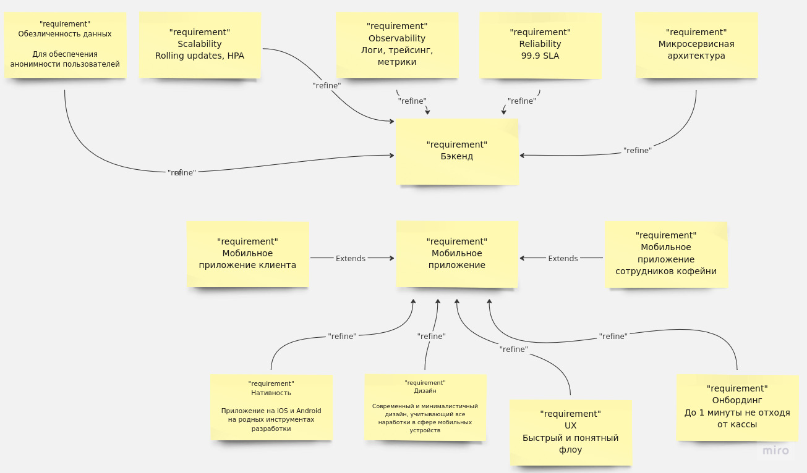
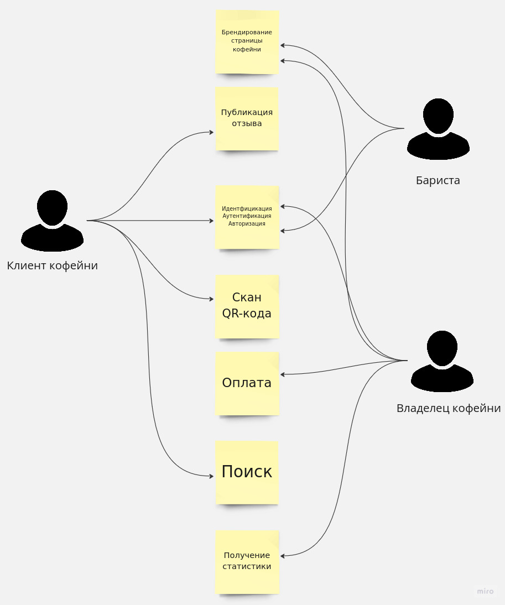
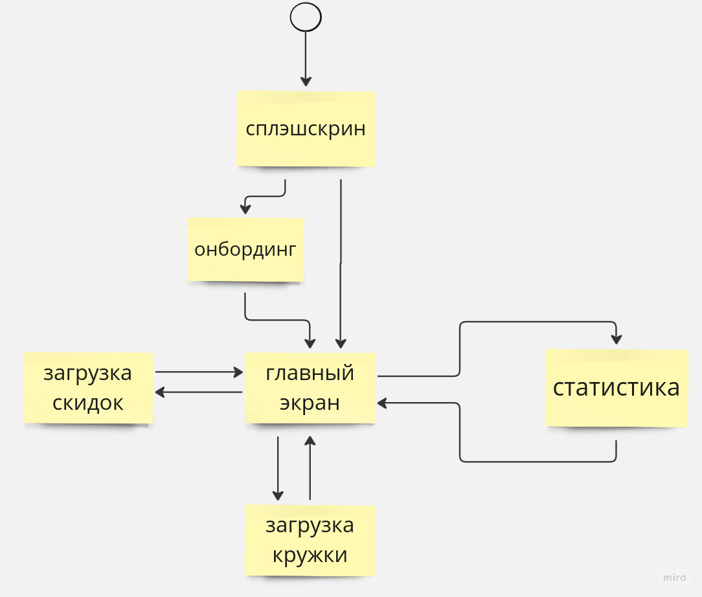
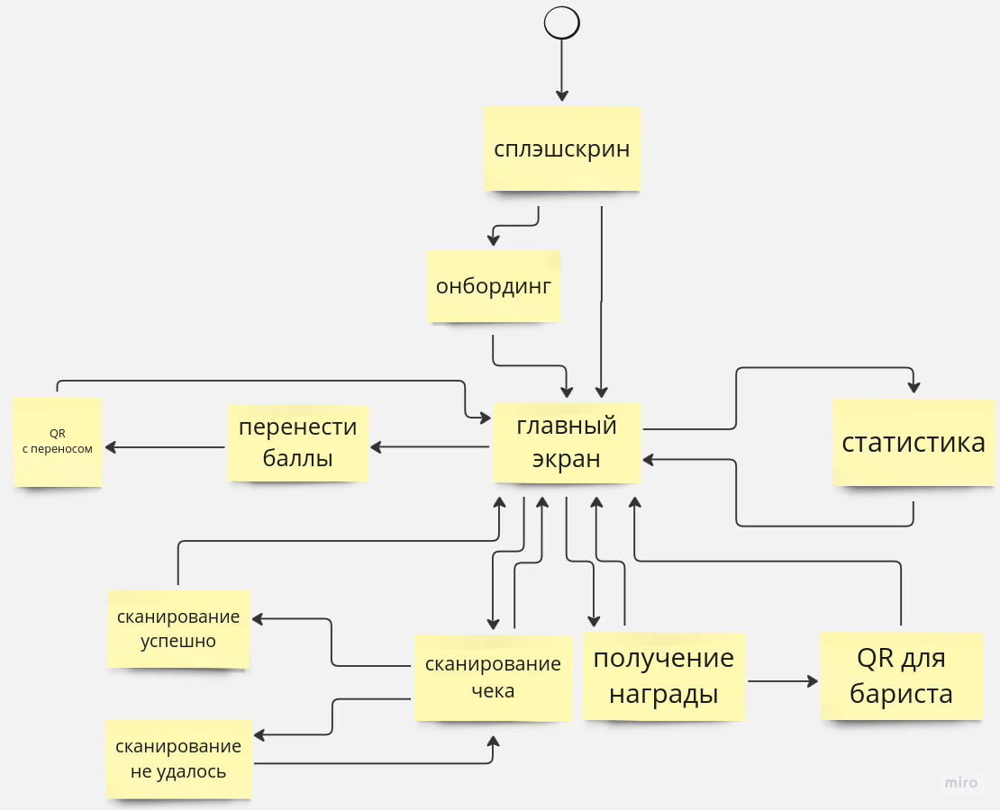
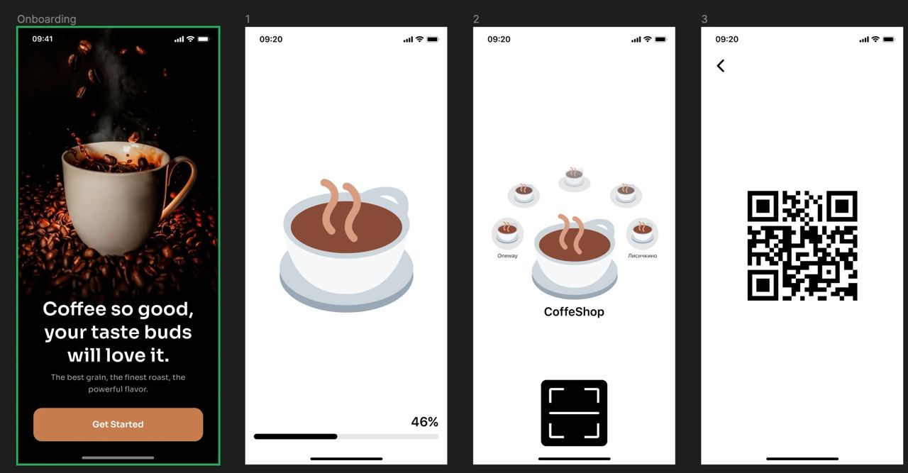
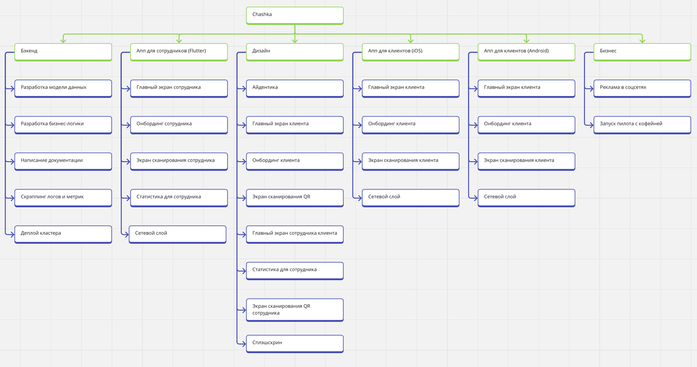
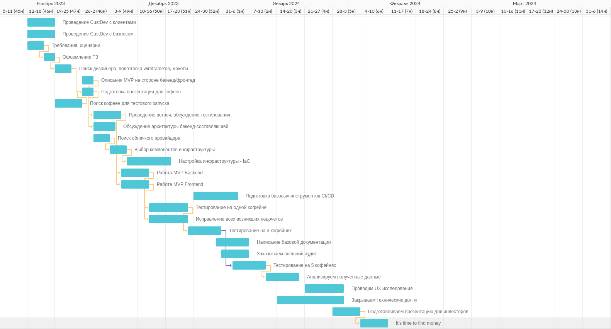
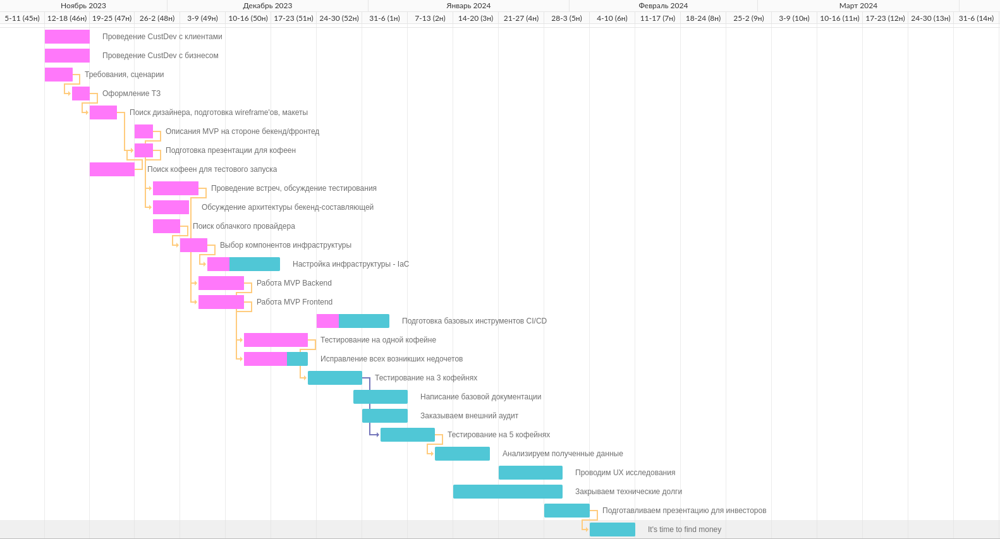

- [ДЗ 3](#дз-3)
  - [Функциональные требования](#функциональные-требования)
  - [Нефункциональные требования](#нефункциональные-требования)
  - [Диаграммa требований](#диаграммa-требований)
  - [Диаграммa случаев использования](#диаграммa-случаев-использования)
- [ДЗ 4](#дз-4)
  - [Screen flow](#screen-flow)
  - [Wireframe](#wireframe)
- [ДЗ 5](#дз-5)
  - [Work structure](#work-structure)
  - [Риски](#риски)
- [ДЗ 6,5](#дз-65)
  - [Диаграмма Гантта](#диаграмма-гантта)
- [ДЗ 7](#дз-7)
  - [Что сделали](#что-сделали)
  - [Что не получилось](#что-не-получилось)
  - [Новые функциональные требования](#новые-функциональные-требования)
  - [Диаграмма Гантта в середине пути](#диаграмма-гантта-в-середине-пути)

---

### ДЗ 3

#### Функциональные требования:

- Предоставлять мобильное приложение для клиентов кофеен
- Предоставлять мобильное приложение для сотрудников кофеен
- Предоставлять веб-страницу со статистикой работы программы лояльности для бизнеса
- По QR-коду получать информацию о покупке через API ФНС России
- Хранить информацию о пользователе: число баллов в программе лояльности по каждой кофейне
- Ранжировать кофейни по отзывам пользователей
- Предоставлять возможности брендирования страниц кофеен
- Идентифицировать, аутентифицировать и авторизовывать без номера телефона, почт, SSO

#### Нефункциональные требования:

- Покрытие серверами по всей России для geo-доставки контента пользователям. Крупнейшая в России сеть CDN
- Доступ 24/7 для покрытия всех часовых поясов (SLA 99.7%)
- Быстрый и удобный онбординг бизнеса. Подключение за 10 минут
- Оценка кофейни в один клик
- Хранение обезличенных данных, аутентификация по secret key и fingerprint
- Онбординг клиента кофейни прямо на кассе не более чем за минуту
- Процесс начисления бонусов лояльности не более чем за 30 секунд
    - Открытие приложения
    - Клик
    - Скан
    - Результат
- Приятная и узнаваемая айдентика, которой можно адаптировать под дизайн помещения, для распространения в рамочку на
  кассе

#### Диаграммa требований

#### Диаграммa случаев использования

### ДЗ 4

#### Screen flow

Экран администратора

Экран пользователя

#### Wireframe

### ДЗ 5

#### Work Structure

#### Риски

| Риск                                          | Последствия                                               | Вероятность | Предотвращение                             | Устранение последствий                        |
|-----------------------------------------------|-----------------------------------------------------------|------------|--------------------------------------------|-----------------------------------------------|
| Отказ в публикации в App Store                | Невозможность обслуживать посетителей с iOS               | Средняя    | Изучить регламент                          | Сменить страну регистрации                    | 
| Падение сервисной экономики                   | Нет необходимости удерживать клиентов в сфере обслуживания | Низкая     | Диверсификация по странам                  | Банкротство или релокация                     |
| Коммодитизация бренда кофейни                 | Нет интереса от кофеен с сильным брендом                  | Высокая    | Кастомизация опыта клиента с кофейней      | Маркетинг, направленный на возвращение кофеен |
| Невозможность оперировать фискальными данными | Нельзя использовать API касс                              | Средняя    | Регистрация ИП   Соблюдение закона о ОФД | Удовлетворение требований регулятора          |
| Низкий ценовой сегмент ЦА                     | Ниже цена подписки   Слабее вирусный эффект            | Средняя    | Хороший UI/UX                              | Маркетинг, нацеленный на спешиалти сегмент    |

### ДЗ 6,5

#### Диаграмма Гантта

### ДЗ 7

#### Что сделали

- Проведены интервью с представителями кофеен для сбора информации по удобному онбордингу.
- Проведены интервью с пользователями. Полученные знания помогли пострить пользователю, стоящему перед кассой, четкий путь в приложении.
- Изучены косвенные и прямые конкуренты, их фичи.
- Реализована базовая функциональность для сканирования чеков и начисления баллов.
- Добавлены возможности идентификации, аутентификации и авторизации без использования номеров телефона и почты.
- Разработан интуитивно понятный (с учетом всех стандартов в UI и UX) интерфейс, который быстро вырабатывает привычку.
- Внедрена система ранжирования кофеен по отзывам пользователей.

#### Что не получилось

- Получение ключа от ФНС сложное мероприятие, стандартный интерфейс работает с ограничение по количеству запросов. 
Сейчас мы используем ферму из сим-карт, но очень ждем решение по нашему запросу.
- Тестовый запуск показал, что цифры ещё далеки до идельных. Первое подключение клиента около 3 минут, а подключение кофейни 10 минут.
- Интеграция в облачного провайдера произошла частично, половина проекта всё ещё работает на домашнем сервере.
- Соглашение работы с кофейнями имеет проблемы с частью среды работы нашего продукта.

#### Новые функциональные требования

- На основе данных о пользователе и кофейнях персонализированно подбирать следующую кофейню. 
Поможет расширить кругозор в области кофе, познакомит с новыми людми, позволит попробовать что-то новенькое. 
Эта фича частично позволит встроить рекламу.
- На основе отзывов и рейтинга составлять краткое описание о кофейне.

#### Диаграмма Гантта в середине пути

